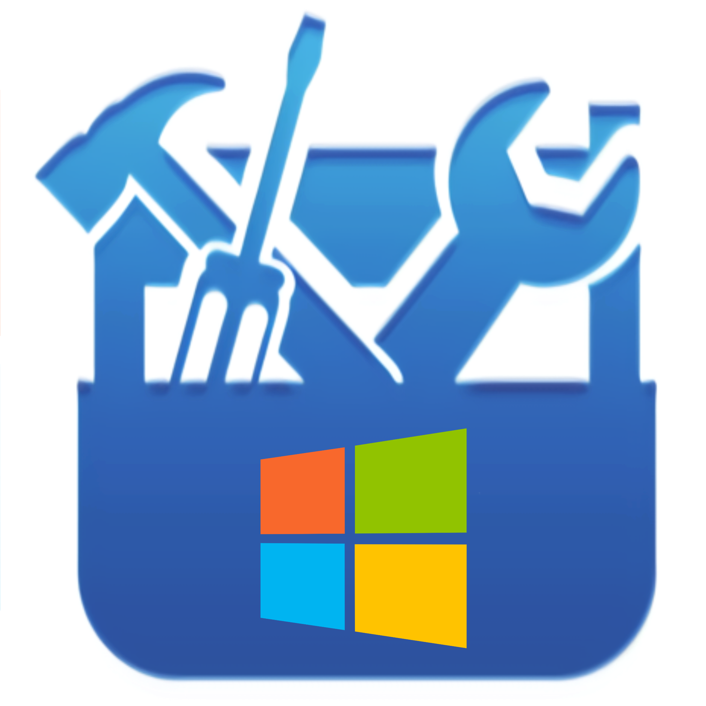

  <h1>Winker</h1>
  
  
Améliorer votre Windows 10

  
  
  
  
  
  
  
  
  
<strong><em>~ 93 Ko</em></strong>

#

<h3>C'est quoi Winker ?</h3>

Winker est un dossier qui regroupe plein de petits logiciels (.bat et .reg) qui permet d'améliorer Windows 10.

<h3>D'où vient le nom Winker ?</h3>

Winker est un mix de Windows et Tweaker.

<h3>Télécharger Winker</h3>

Vous pouvez télécharger Winker <a href="https://www.clictune.com/jsfp">ici</a> ou <a href="Winker.zip?raw=true">ici</a>.

<h3>Projet similaire</h3>

J'ai aussi réalisé un autre projet pour Android sous le nom d'<a href="https://www.clictune.com/jsfq">Androker</a>.

#

<h2>Recommandation</h2>

  | Logiciel | Description | Version |
  |----------|--------------|---------|
  | <a href="https://www.clictune.com/jsfr">Bloatbox</a> | Désinstaller les <a href="">bloatware</a> |  |
  | <a href="https://www.clictune.com/jsfs">Chocolatey</a> | Winget, Installeur d'application |  |
  | <a href="https://www.clictune.com/jsft">CrystalDiskInfo</a> | Vérifier l'état de votre disque | <a href="https://www.clictune.com/jsfD">???</a> |
  | <a href="https://www.clictune.com/jsfv">Chris Titus Tech's Windows Utility</a> | Installeur d'applications, optimisateur, debloat | <a href="https://www.clictune.com/jsfE">???</a> |
  | <a href="https://www.clictune.com/jsfw">WindowsSpyBlocker</a> | Bloquer l'espionnage et le pistage |  |
  <a href="https://www.clictune.com/jsfx">WhoCrashed</a> | Voir les détails des écrans bleus | <a href="https://www.clictune.com/jsfG">Free Home Edition</a> |
  | <a href="https://www.clictune.com/jsfy">WhySoSlow</a> | Voir pourquoi votre système est lent | <a href="https://www.clictune.com/jsfH">Free Home Edition</a> |
  | <a href="https://www.clictune.com/jsfA">WPD</a> | Supprimer la télémétrie et le pistage | <a href="https://www.clictune.com/jsfI">???</a> |

